If you know Kubernetes, but you've never heard of a "service mesh", this post is for you.

By the end of this post, you'll know:

- What problem Kmesh is solving (and why that problem matters)
- How the current solutions work (and why they're slow)
- What Kmesh does differently (and why it's faster)
- How all the pieces fit together

   <!-- truncate-->

## What is a Service Mesh and Why Does It Exist?

You must have deployed apps on Kubernetes. You know that your application runs inside a Pod, and that Pods talk to each other through Services. You write a YAML file, run `kubectl apply`, and your app is running.

Now imagine you're not deploying one app. You're deploying fifty. Imagine you are an engineer at a fast-growing **e-commerce company**. Your team started with a **monolithic application**—a single, large codebase handling user requests, inventory, and payments. As the company grew, you migrated to a microservices architecture with separate services for:

- **User Service** (handles user accounts)
- **Order Service** (processes orders)
- **Inventory Service** (tracks stock)
- **Payment Service** (handles payments)

At first, everything runs smoothly. But as complexity increases, several massive problems emerge:

- **Authentication & Authorization is duplicated.** Every microservice has to handle logins and permissions separately. Your developers are writing the same security logic over and over again for the Order Service, the Inventory Service, and the Payment Service.
- **Failures become tougher to debug.** Logs indicate errors in the Payment Service, but it's unclear whether these issues are from network glitches, load spikes, or faulty service updates. There is no central visibility.
- **Unencrypted Security Risks.** Sensitive data, like payment details, is being transmitted between your services unencrypted. Without proper encryption (like mTLS), any breach in your cluster becomes a major risk.
- **Dumb Load Balancing.** You have three replicas of your Payment Service. The Order Service is overwhelmed while the Inventory Service remains underutilized. Standard Kubernetes traffic distribution isn't smart enough to handle complex routing.
- **Complex Canary Deployments.** Let's say you want to release a new version of the Payment Service. Ideally, you want to route exactly 10% of your live traffic to the new version to test it out, but doing so without downtime is significantly challenging.

Every production team eventually faces:

*"Who is making sure all of this communication works properly?"*

This growing complexity makes managing your microservices **painful**. Several solutions have been proposed to address this.

## How the Industry Tried to Fix It

These problems weren't unique to your company. Every engineering team building microservices ran into the same wall. And the industry didn't solve it overnight—it went through three distinct eras of trying.

Think of it like this: the networking logic that keeps your services talking to each other had to *live* somewhere. The question was always—**where?**

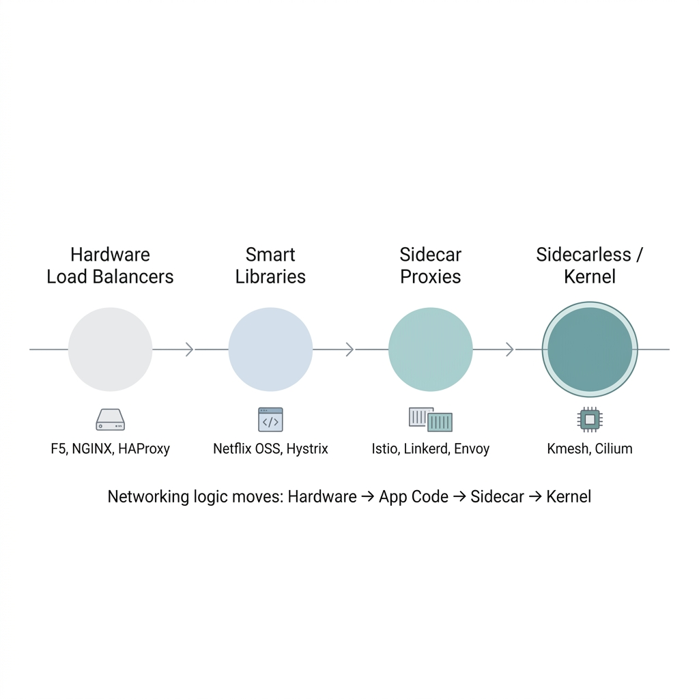

---

### Era 1: The Big Box in the Middle (Hardware Load Balancers)

The earliest answer was straightforward: put a big, expensive box between your clients and your servers.

If you've been around infrastructure long enough, you've heard names like **F5 BIG-IP**, or maybe you've set up **NGINX** or **HAProxy** as a reverse proxy. The idea was simple—all traffic enters through one central point, and that point decides which backend server gets the request.

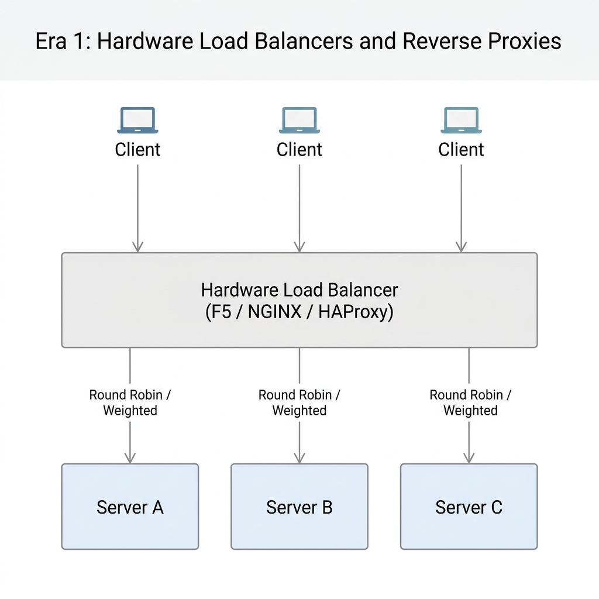

This worked fine when you had a handful of backend servers. Your company had maybe 3-5 services, and a load balancer in front of them was perfectly manageable.

But here's where it breaks down with microservices:

- **It only handles North-South traffic.** A load balancer sits at the edge. It distributes traffic *coming into* your cluster. But what about Service A calling Service B calling Service C *inside* the cluster? That's East-West traffic, and the load balancer doesn't even see it.
- **It becomes a single point of failure.** Every request flows through one box. If that box goes down, everything goes down.
- **It doesn't understand your application.** A load balancer can do round-robin or weighted routing, sure. But it doesn't know how to retry a failed request, or detect that one of your services is unhealthy and should be pulled from rotation automatically.

As the number of microservices grew from 5 to 50 to 500, pointing everything at one big box in the middle simply stopped making sense. The networking logic needed to move closer to the services themselves.

---

### Era 2: Bake It Into the Code (Smart Libraries)

Netflix was one of the first companies to really feel the pain of running hundreds of microservices. And their answer was pretty direct: if the infrastructure can't handle this, let's handle it *in the application code itself*.

They built a set of open-source Java libraries — collectively called **Netflix OSS** — that developers would import directly into their services. Think of it like adding an extra package to your project, except this package handled all the networking headaches for you:

- **How do I find another service?** → Eureka (service discovery)
- **What if that service is down?** → Hystrix (stop calling a broken service, don't let it drag you down too)
- **Which instance should I send my request to?** → Ribbon (pick the healthiest one)
- **How should I route incoming traffic?** → Zuul (smart routing)

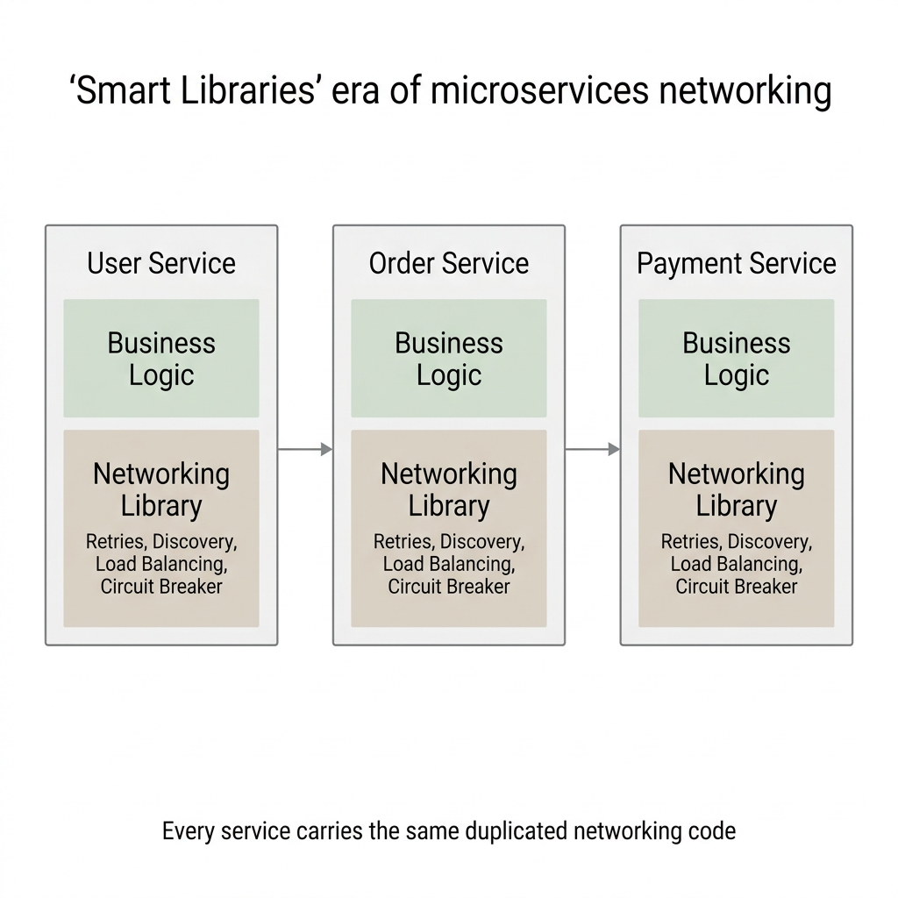

Every microservice now carried its own networking smarts built right into the application code.

Netflix scaled to hundreds of microservices this way. Other companies followed — Twitter built Finagle, Google had internal equivalents.

But as teams adopted this approach, cracks started showing:

- **Language lock-in.** Netflix OSS was Java. If your ML team writes Python and your frontend team uses Node.js, you'd have to rewrite all that networking logic from scratch for each language. Not realistic.
- **Upgrade nightmare.** Found a bug in one of these libraries? You now need to update it in *every single microservice*, rebuild, test, and redeploy each one. With 200 services, that's not a quick patch — that's a week-long campaign.
- **Your developers didn't sign up for this.** They wanted to build a payment system, not debug why the load balancing library is sending traffic to a dead instance. Business logic and networking plumbing were tangled together in the same codebase.

The big takeaway from this era was clear: **the networking logic needs to live outside the application code**. Developers should focus on business logic. Something else should handle the networking.

But that "something else" shouldn't be one big box in the middle either. What if you could pull the networking logic out of the code and run it *right next to* the application — but as its own separate process?

---

### Era 3: The Sidecar Proxy (The Birth of the Service Mesh)

Instead of embedding networking logic inside your application, you deploy a small, lightweight proxy *alongside* every instance of your service. In Kubernetes terms, this proxy runs as a second container inside the same Pod. The most popular one is **Envoy**, originally built at Lyft.

Here's how it works. Back to your e-commerce example:

1. Your **Order Service** wants to call the **Payment Service**. It doesn't call it directly — the request gets transparently intercepted (via iptables rules) and redirected to the **Envoy sidecar** running in the same Pod.
2. The Envoy sidecar applies all the networking logic (load balancing, retries, mTLS encryption, timeouts) and forwards the request to the Payment Service's Pod.
3. There, the request hits the **Envoy sidecar inside the Payment Service Pod** first (rate limiting, auth checks), and only *then* reaches your actual Payment Service code.

Here's Istio's own architecture diagram showing this in action — the Data Plane (proxies) at the top and the Control Plane (Istiod) at the bottom:

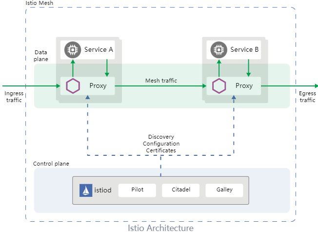

And here's a more detailed view of the Service Mesh architecture with sidecar proxies managing all mesh traffic between pods:

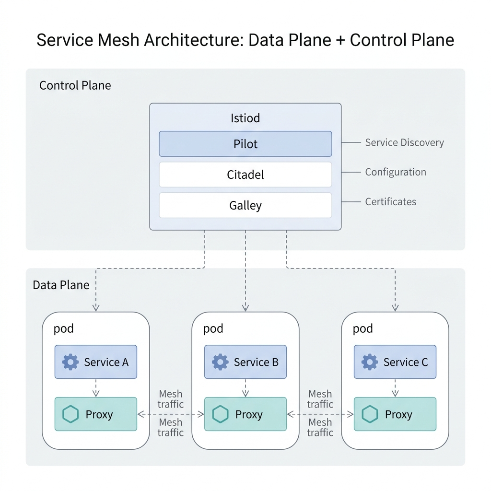

Why was this a breakthrough?

- **Language independence:** Order Service in Java, Payment Service in Go? Doesn't matter — the same Envoy proxy handles networking for all of them.
- **No code changes:** Developers write plain business logic. No networking libraries to import. The proxy handles everything transparently.
- **Centralized control:** All sidecars get their config from a **Control Plane** (like Istio's Istiod). Want mTLS everywhere? One policy change, pushed to every sidecar. No redeployments.
- **Uniform observability:** Every request flows through a sidecar, so you get metrics, traces, and logs for *all* service-to-service traffic automatically.

**This** is what a Service Mesh is:

> **A service mesh is an infrastructure layer that manages service-to-service communication. It consists of a Data Plane (the sidecar proxies handling the actual traffic) and a Control Plane (the central brain configuring all the proxies).**

Projects like **Istio**, **Linkerd**, and **Consul Connect** implement this pattern. Authentication? The mesh handles it. Encryption? mTLS everywhere. Canary/test deployments? Route 10% of traffic to the new version with just one config change.

---

### So If the Service Mesh Solved Everything, Why Are We Still Talking?

Because it introduced a *new* problem. A performance problem.

Instead of Service A talking directly to Service B, the request bounces through **four extra network hops**: out of Service A's container → into Service A's sidecar → across the network → into Service B's sidecar → into Service B's container.

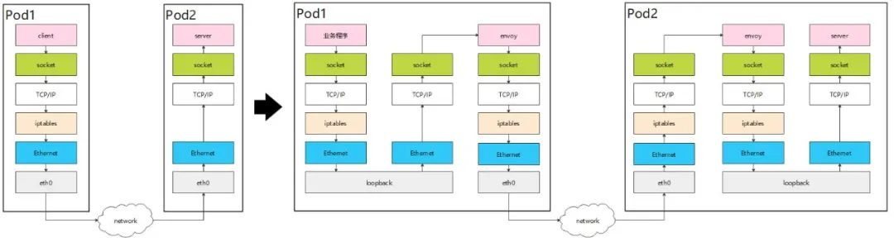

All that bouncing means data gets copied back and forth between **user space** and **kernel space** multiple times. It means extra TCP connections get established. It means more CPU cycles, more memory, and more latency.

According to Istio's own benchmarks, a single Envoy proxy adds approximately **2.65 milliseconds** of latency at the 90th percentile, and this overhead compounds as requests traverse multiple proxies/hops.

*But what if the networking logic didn't have to run in user space at all?*

That question is what leads us to eBPF and Kmesh — which we'll cover in the next section.

---

## Why Traditional Service Meshes Are Slow

To understand why, we need to understand how your operating system handles memory.

### The Wall Between User Space and Kernel Space

Linux splits its memory into two strictly isolated zones:

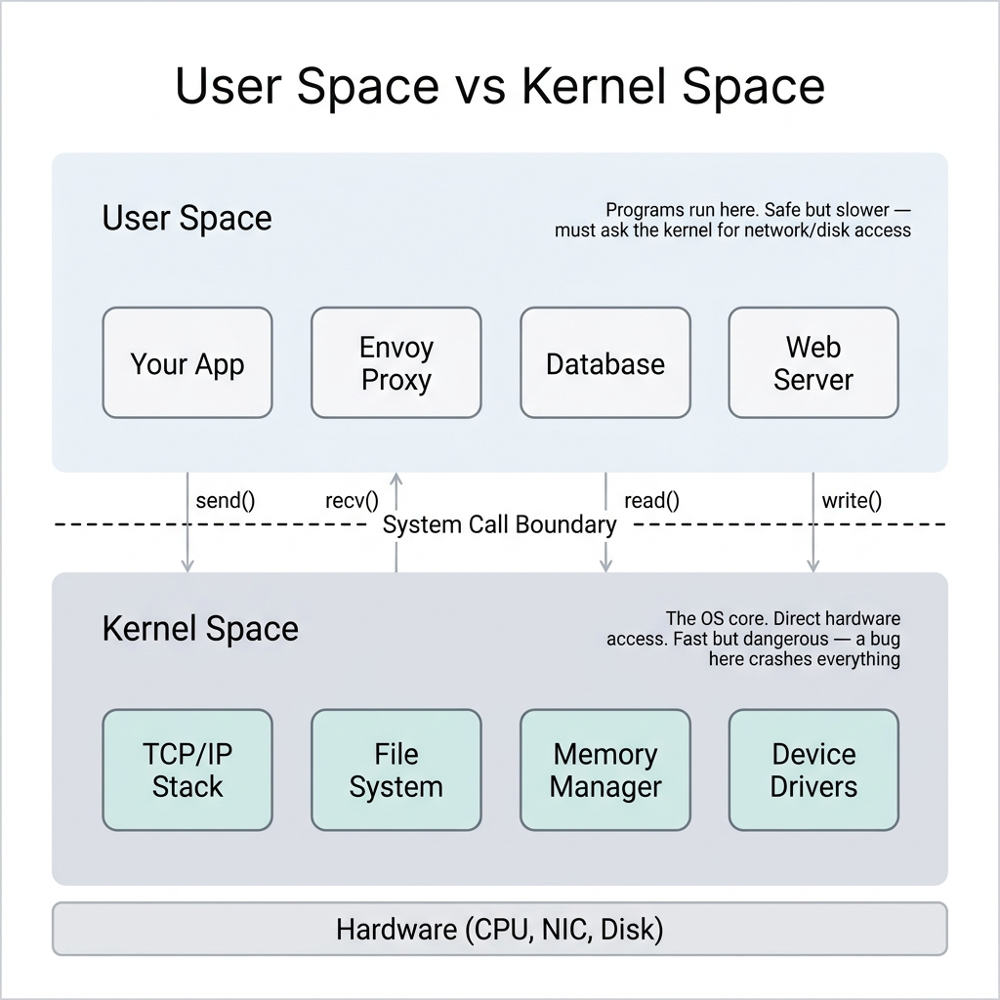

Think of **User Space** as the safe playground where your application, your database, and your Envoy proxy live. If an app crashes here, it's isolated. No big deal.

**Kernel Space**, on the other hand, is the engine room. It has direct access to the hardware (network cards, disks, CPU). It's incredibly fast, but if something crashes here, the whole server goes down. Because of this risk, programs in User Space are completely walled off from the hardware. If your app wants to send a network packet, it has to politely ask the Kernel to do it via a "system call."

Here is the golden rule of OS performance: **Crossing that boundary between User Space and Kernel Space is expensive.** It costs CPU cycles, memory copies, and time.

### The Bouncing Problem

Without a service mesh, two microservices talking to each other cross that boundary exactly twice. App A sends a request down to the kernel, the kernel ships it across the network, and the receiving kernel passes it up to App B. Simple.

But watch what happens to that exact same request when we drop an Envoy sidecar proxy into the mix:

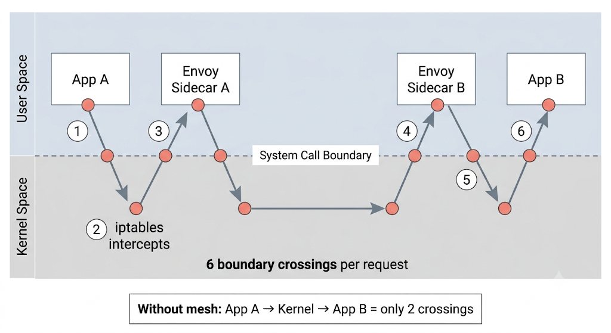

Notice how the request is suddenly playing ping-pong across the system call boundary?

Instead of a clean, direct path, the traffic is intercepted by `iptables`, forced up into the Envoy sidecar, processed, and sent back down into the kernel. Then, the exact same steps happen on the receiving end.

What used to be 2 boundary crossings has exploded into **6 boundary crossings** for a single request.

### Where is the Time Actually Going?

You might be thinking, *"Sure, but Envoy is doing a lot of valuable work like mTLS and intelligent routing!"*

You'd be right, but take a look at this breakdown of where the sidecar latency actually comes from:

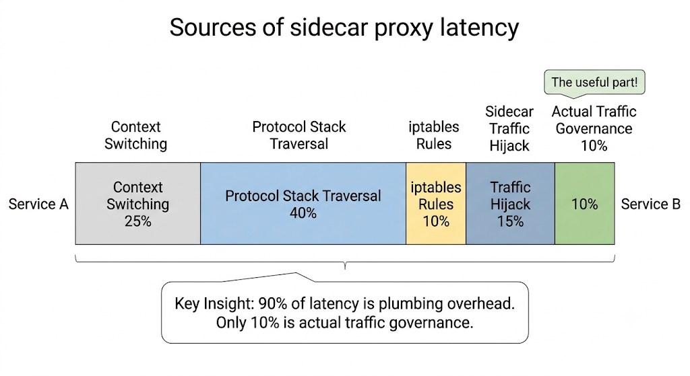

This is the harsh truth of traditional service meshes: **90% of the overhead is just plumbing.** Only a tiny sliver of the time (10%) is actually spent doing the traffic governance we bought the service mesh for in the first place! The rest is just the tax we pay for bouncing data back and forth between the kernel and our user-space proxy.

And the toll adds up. According to Istio's official benchmarks, **a single Envoy proxy adds 2.65 milliseconds of latency** to the 90th percentile:

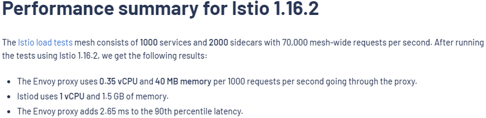

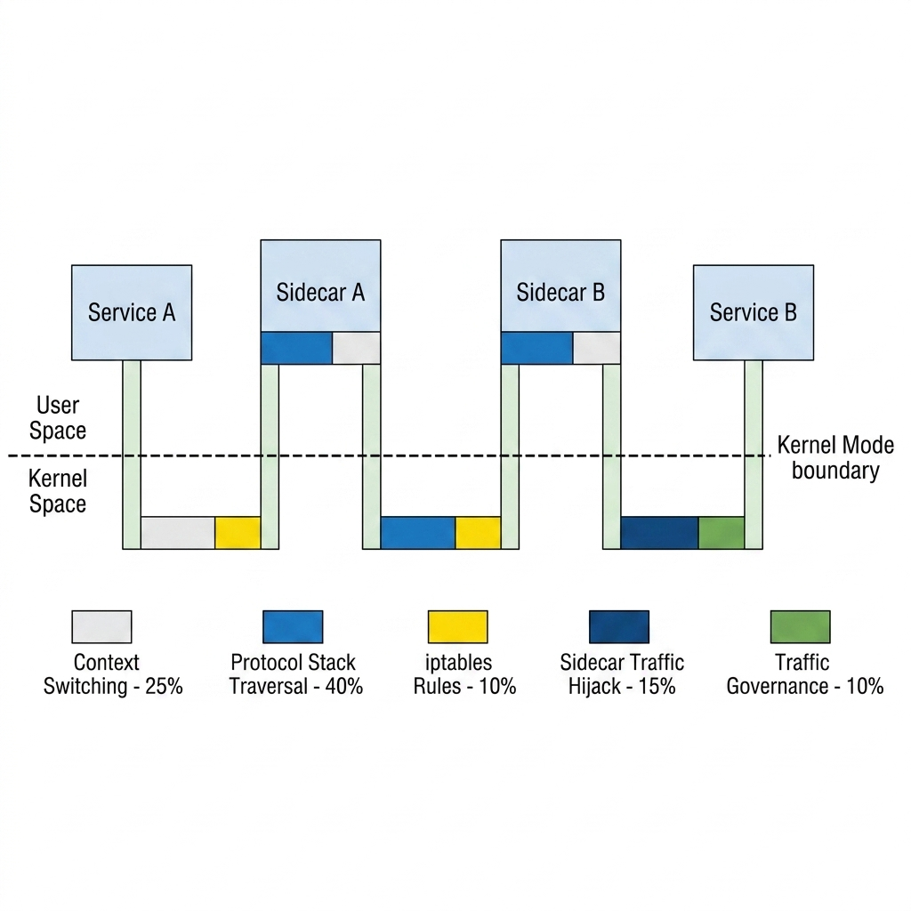
 
But, what if we could just run our networking logic directly inside the kernel, right where the traffic is already flowing?

That is done via eBPF.

---

## What is eBPF?

**eBPF** (extended Berkeley Packet Filter) **allows you to run your own custom programs safely inside the Linux kernel, without having to change the kernel source code or reboot the machine.**

### How Does That Even Work?

Imagine the Linux kernel is a highly secure bank vault. Before eBPF, if you wanted to change how the vault operated, you had to rewrite the blueprint and rebuild the vault (writing a kernel module). It was slow, dangerous, and one mistake could blow the whole thing up.

eBPF changes the game. It gives you a way to slide instructions under the vault door.

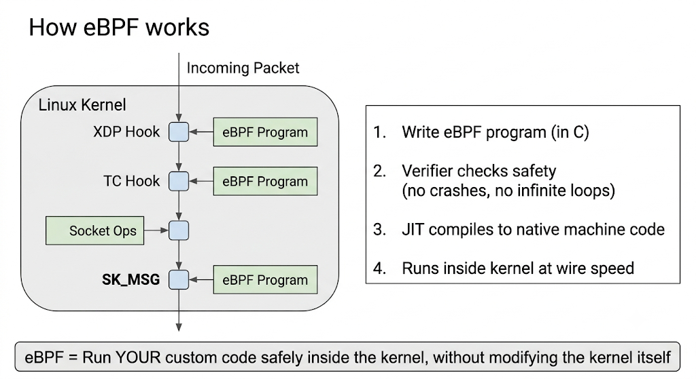

As you can see in the diagram, you write your eBPF program, and a built-in **Verifier** checks it to ensure it won't crash or get stuck in an infinite loop. Once it passes the security check, the kernel compiles it and attaches it to specific "hooks" on the network path.

Your custom code is now running safely inside the vault, at native wire speed.

### Why This Changes Everything for Service Meshes

*A hook is just a checkpoint in the kernel's code where eBPF programs can be attached. Each one works at a specific stage of the packet's journey, letting you inspect, modify, or redirect traffic without touching the kernel source.*

With eBPF, we can short-circuit that entire journey. Look at the bottom hook in the diagram above — **SK_MSG**. It lets an eBPF program grab traffic right at the source and redirect it straight to its destination, without ever leaving the kernel. No detour through user space. No bouncing.

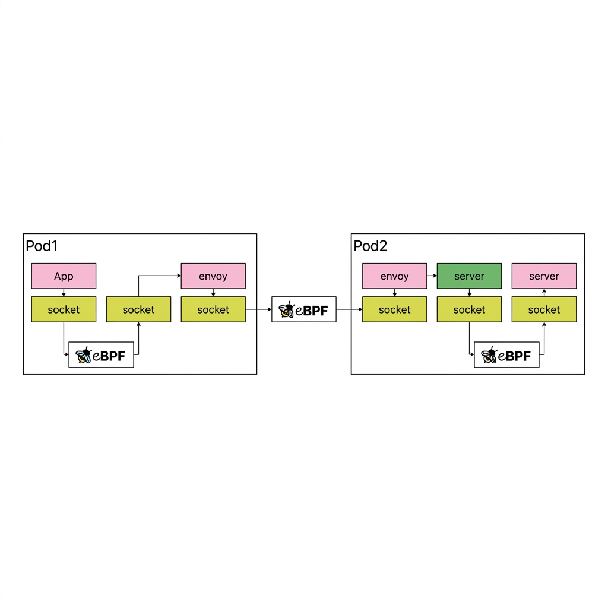

Think of it like this: instead of your package going through six different post offices (the bouncing problem), eBPF lets a worker inside the sorting facility hand it directly to the right truck. Same building. No unnecessary trips.

**This is the missing piece.** If we can run our routing and load balancing logic as eBPF programs inside the kernel, we don't need sidecar proxies sitting in user space anymore.

*And that is exactly what Kmesh does. Let's dive into it.*

---

## How Kmesh Works

Now that we understand eBPF, the idea behind Kmesh becomes almost obvious: **move the traffic governance logic from user-space sidecar proxies into the kernel using eBPF.**

### From 3 Hops to 1 Hop

In a traditional service mesh, every request between two services takes a route through three separate connections:

> **App A → Envoy Sidecar A → Envoy Sidecar B → App B**

Three hops. Three TCP connections. Six boundary crossings between user space and kernel space. We've seen why that's expensive.

Kmesh removes the sidecars entirely:

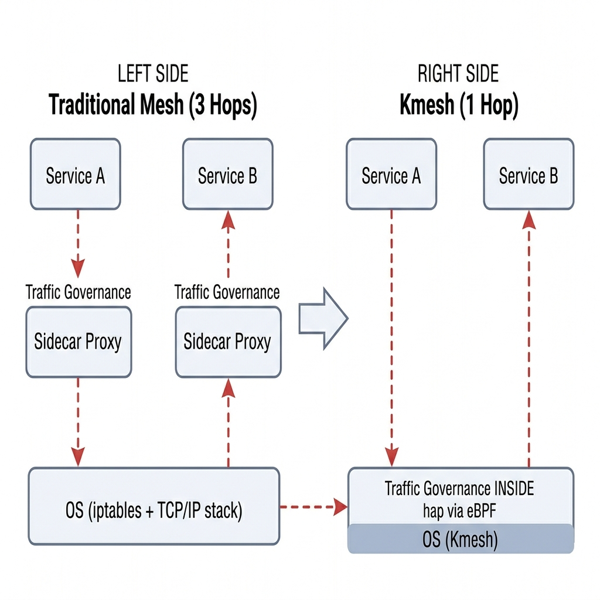

On the left, you can see the traditional approach where traffic bounces up to sidecar proxies for governance, then back down through the OS. On the right, Kmesh moves that governance logic directly into the OS layer using eBPF. The result is a single, clean hop:

> **App A → Kernel (Kmesh eBPF) → App B**

One connection. Two boundary crossings. The routing decision, the load balancing, the traffic policy — it all happens inside the kernel, right on the natural path the packet was already taking.

### How Does Kmesh Know Where to Route Traffic?

Kmesh doesn't reinvent any of the control plane logic. If you're already using Istio, defining your traffic rules works exactly the same way. Same YAML files, same routing policies, same canary deployments.

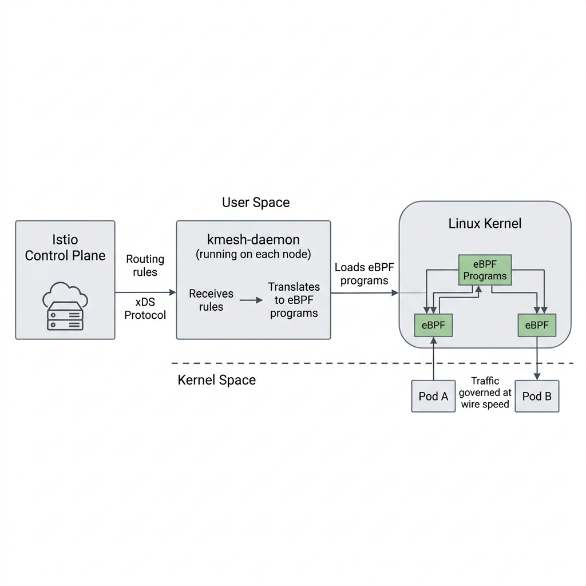

As the diagram shows, a lightweight component called **kmesh-daemon** runs on each node in your cluster. Its job is:

1. **Listening** to Istio's control plane for routing rules via **xDS** (a standard protocol that Istio uses to push configuration to its data plane) — both Envoy and Kmesh use xDS.
2. **Translate** those rules into eBPF programs.
3. **Load** them into the kernel.

Once those eBPF programs are in the kernel, traffic between Pod A and Pod B is governed at wire speed — no proxy containers, no extra pods, no resource overhead per service.

### What About Complex HTTP Routing? (L4 vs L7)

Not all traffic is equal, and this is where Kmesh gets smart about it.

**Layer 4 (L4)** traffic — basic TCP connections, load balancing, connection management — is perfect for eBPF. It's straightforward enough that eBPF handles it entirely inside the kernel with zero overhead.

But **Layer 7 (L7)** traffic is a different beast. Think HTTP header-based routing (*"send requests with header X-Version: v2 to the canary deployment"*), complex retry policies, or request-level authentication. These need deep packet inspection that goes beyond what eBPF programs can efficiently do today.

Kmesh solves this with a smart split:

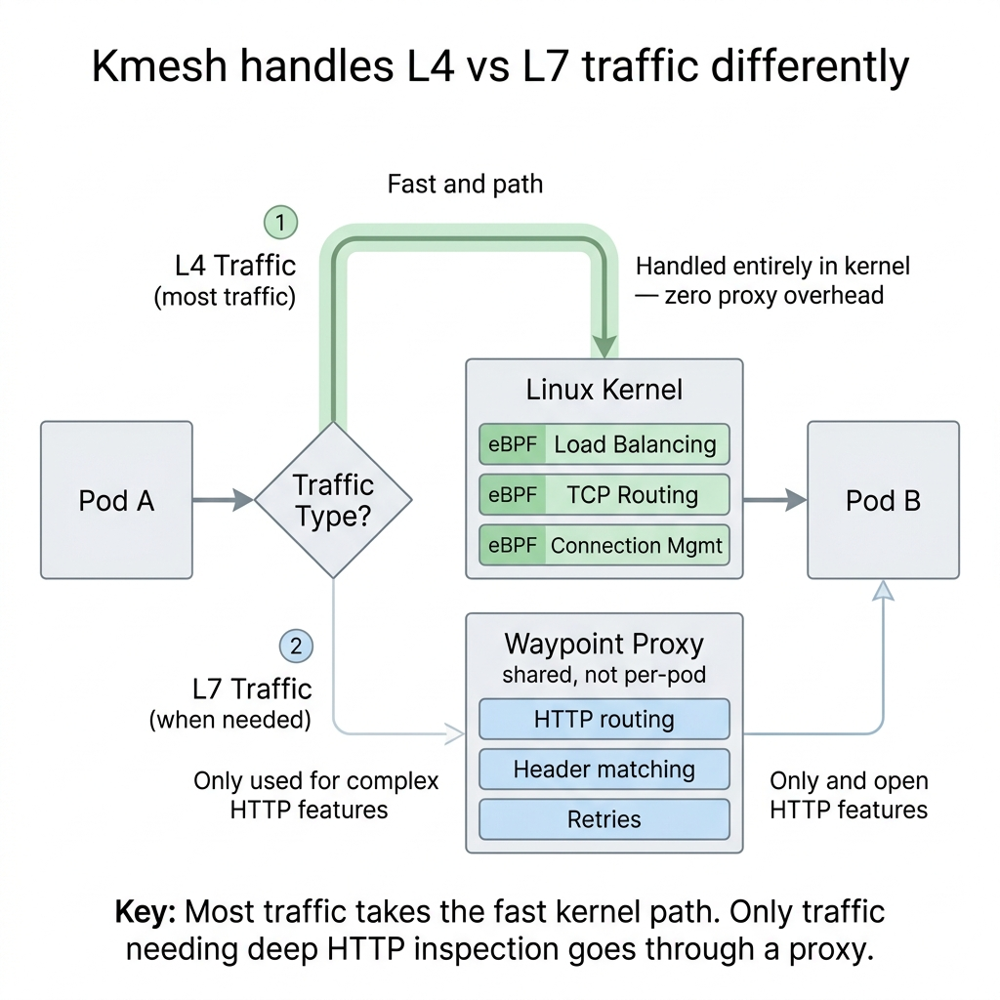

As you can see, most of your traffic (L4) takes the fast path — handled entirely in the kernel by eBPF with zero proxy overhead. Only the traffic that genuinely needs deep HTTP inspection gets routed to a shared **Waypoint Proxy**.

The key difference from traditional meshes: instead of *every* pod paying the sidecar tax, only the small slice of traffic that actually needs L7 processing touches a proxy. Everything else goes through the kernel.

---

## Kmesh vs Traditional Mesh

Let's get to the numbers. This performance chart from the Kmesh project tells the whole story:

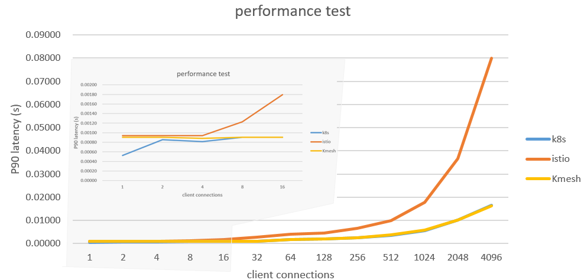

Look at what happens as connections scale up. The blue line (raw Kubernetes, no mesh) and the yellow line (Kmesh) stay nearly flat — Kmesh adds almost zero overhead compared to having no mesh at all. The orange line (Istio with Envoy sidecars) shoots up dramatically.

Here's the full comparison:

|  | **Traditional Mesh** | **Kmesh** |
| --- | --- | --- |
| **Data path** | 3 hops (App → Sidecar → Sidecar → App) | 1 hop (App → Kernel → App) |
| **Latency overhead** | +2.65ms per hop | Near-zero |
| **Sidecar per pod** | Yes (0.35 vCPU + 40MB each) | No |
| **L4 performance** | User-space proxy | Kernel-speed eBPF |
| **L7 support** | Per-pod Envoy sidecar | Shared Waypoint Proxy |
| **Works with Istio** | Yes (native) | Yes (same xDS config) |
| **Linux kernel requirement** | Any | 5.10+ (for eBPF features) |

**When to use Kmesh:** You care about latency or you're running a modern Linux kernel (5.10+), and you want the benefits of a service mesh without the resource overhead.

**When to stick with traditional sidecars:** You're on older kernels that don't support the required eBPF features, or you need every single request to go through deep L7 processing.

### In Short

Traditional service meshes use sidecar proxies that bounce traffic between user space and kernel space — adding latency and eating resources. Kmesh uses eBPF to handle traffic governance directly inside the Linux kernel. Same features (load balancing, mTLS, routing), but without the sidecar overhead.

---

## Getting Started

Kmesh installs via Helm on any Kubernetes cluster with a modern Linux kernel. If you're already running Istio, Kmesh plugs right in as an alternative data plane — your existing traffic policies keep working.

- 👉 [**Quick Start Guide**](https://kmesh.net/docs/setup/quickstart/) — Get Kmesh running in under 5 minutes
- 👉 [**GitHub Repository**](https://github.com/kmesh-net/kmesh) — Star the project and explore the code
- 👉 [**Community Slack**](https://app.slack.com/client/T08PSQ7BQ/C06BU2GB8NL) — Say hi, ask questions, find your first issue

Kmesh is a **CNCF Sandbox project** and actively welcomes contributors. Whether it's fixing a bug, improving documentation, or just exploring the codebase — every contribution matters.

*If you found this useful, share it with someone who's new to cloud-native networking — and come build with us.*
